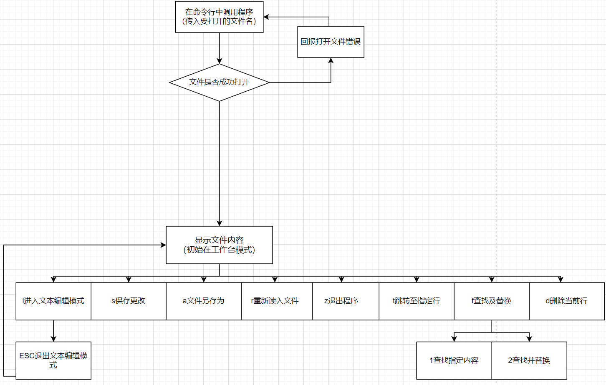

# SimpEditor
## 功能设计

本程序为命令行工具，可以添加在Windows用户变量中在命令行中调用，操作界面类似vim文本编辑器，进入后处于工作台模式，此时键入不同的键值可以调用不同的功能

- 键入i进入文本编辑模式，在此模式中能够进行文本的编辑和处理，退出文本编辑模式按ESC；
- 键入s保存更改，确认后将缓冲区中的内容重新传入文件中
- 键入a将当前缓冲区中内容另存为新文件
- 键入r后输入文件名可以打开新文件(会询问是否保存当前文件)
- 键入z后退出程序，同样会询问是否保存当前文件
- 键入t后将跳转至输入的指定行位置
- 键入f再选择查找与替换，查找与替换都将从文首向文末进行查找和替换
- 键入d后删除当前行